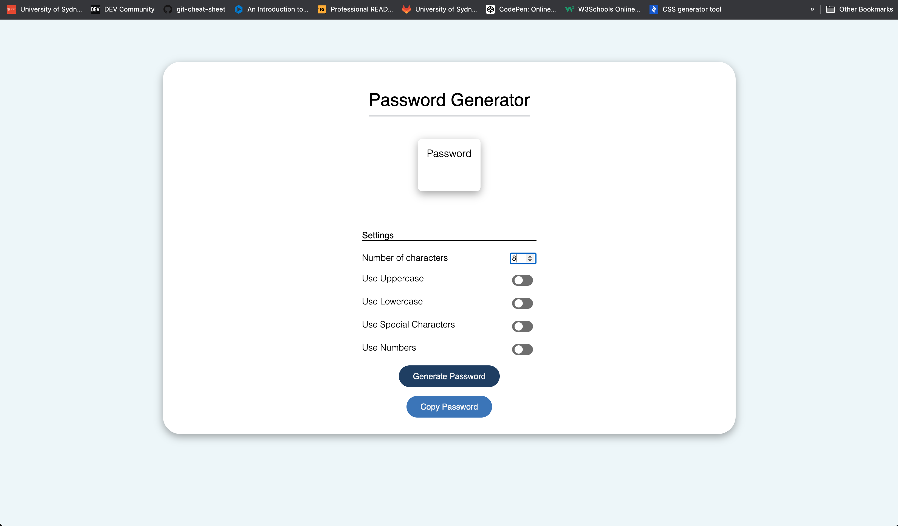

# <Randomized-Password-Generator>

## Description
I have created a randomized password generator with a copy function and toggle switches. I have previously had experience making a similar project in C, so I dediced to see if I could challenge myself in designing a password generator by implementing a cleaner UI and added a copy function to allow for more user control. It was an opportunity to combine the visual and structural architecture that HTML and CSS offers in conjunction with the logic orientated approach of Javascript. In building this project I learnt:
- how to connect javascript to html inputs
- customizing checkboxes
- building a copy button function
- how to cancel the default refresh function of pages
- understanding how my previous experience of C translates similarly into Javascript
- looking for ways to improve user experience despite already having the necessary function working

## Usage
This is the link to the live site: 

## Credit
Here are a list of resources I have used to build this project:

- https://developer.mozilla.org/en-US/docs/Web/HTML/Element/input/checkbox
- https://developer.mozilla.org/en-US/docs/Web/HTML/Element/input/number
- https://css-tricks.com/snippets/css/a-guide-to-flexbox/
- https://codepen.io/dev_loop/details/vYYxvbz
- https://stackoverflow.com/
- https://www.w3schools.com/w3css/w3css_input.asp
- https://coolors.co/palettes/trending

Used for button design
- https://getcssscan.com/css-buttons-examples
- https://www.youtube.com/watch?v=0QJP5-Hyndw

Used to help build and understand copy button javascript
- https://jeroenwiersma.com/javascript-for-optimizers-12-copy-to-clipboard-button/